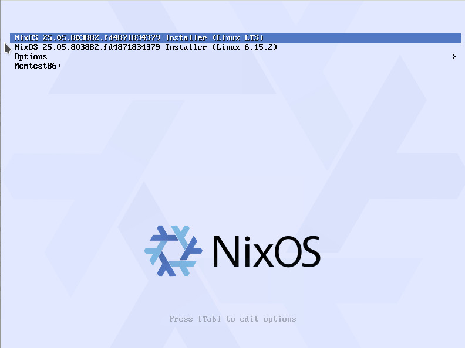
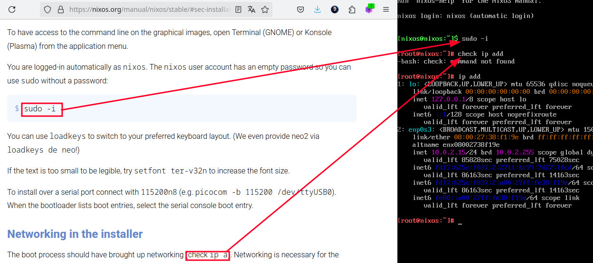
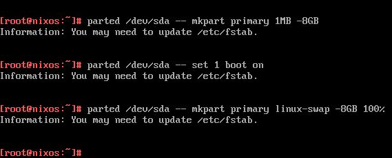

2025-06-19
linux nixos
# NixOS
## Desafio instalar NixOS
### Passo a passo para instalar o NixOS, incluindo erros
----


Bom. Desafio: Neste texto vou passo a passo me estrepar baixando o
NixOS minimo, instalar Plasma, vpn, Firefox, Vscode, Terraform, Aws,
Chrome, Bup e o que mais for útil para mim. somente LTS/Stable/O que
for seguro e contínuo.
Vou conseguir? Provável não. Mas vamos lá

Meu contato com Nix* até agora foi:
- Baixar o NixOS - Me perdi nos pacotes, parei.
- Instalei o gerenciador de pacotes, instalei bash, sem tempo para
alisar SO. Parei.

Então, vou começar tudo do zero, print cada parte que estou vendo e
fazendo e colocando abaixo. Ao vivo. Incluindo erros.

1. Baixar a iso minimal LTS do https://nixos.org/download/, mais
exatamente a )


2. Subir no virtualbox com 24GB de memória, 8 CPU, 80% de uso máximo
e 100GB de disco. Não está na documentação e quero que sobre.
https://nixos.org/manual/nixos/stable/


3. Boot e bora seguir a documentação pois chegou no terminal live.
Ainda não sei o que fazer, mas vamos ler nas docs
https://nixos.org/manual/nixos/stable/



5. Na documentação, pulei para instalação manual, e seguindo a
documentação ao pé da letra:
```
$ sudo -i
# check ip add
-bash: check: command not found
```

Sei que deveria ser apenas "ip address" o comando, mas hoje vou ser o
cara mais caxias que posso pois está na doc.

https://nixos.org/manual/nixos/stable/#sec-installation-manual


5. Particionar? Bora tocar o sarrafo. Lembre-se o objetivo é ter um
desktop útil a mim, e seguindo a DOC, usei parted exatamente como na
doc
NOTA: As imagens apenas são reprodução da documentação e dos comandos
no terminal. Sempre vou mandar o link referenciando.

https://nixos.org/manual/nixos/stable/#sec-installation-manual-partitioning-UEFI
